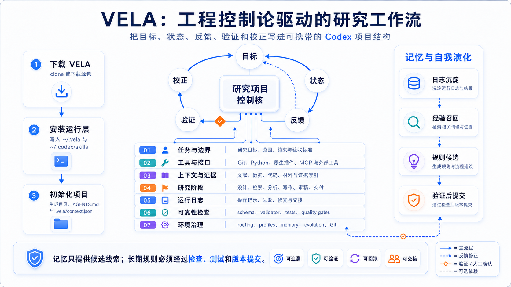
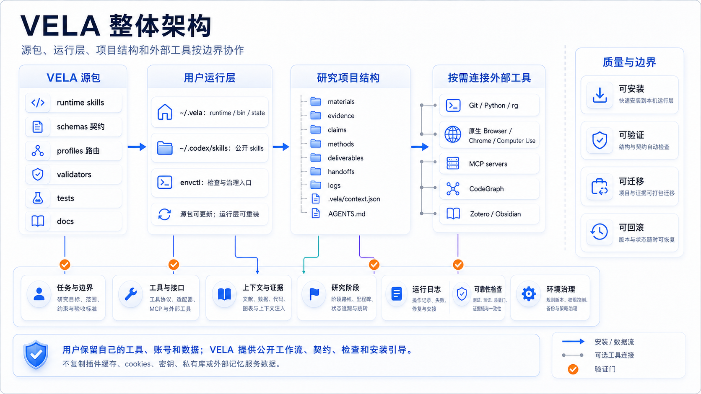
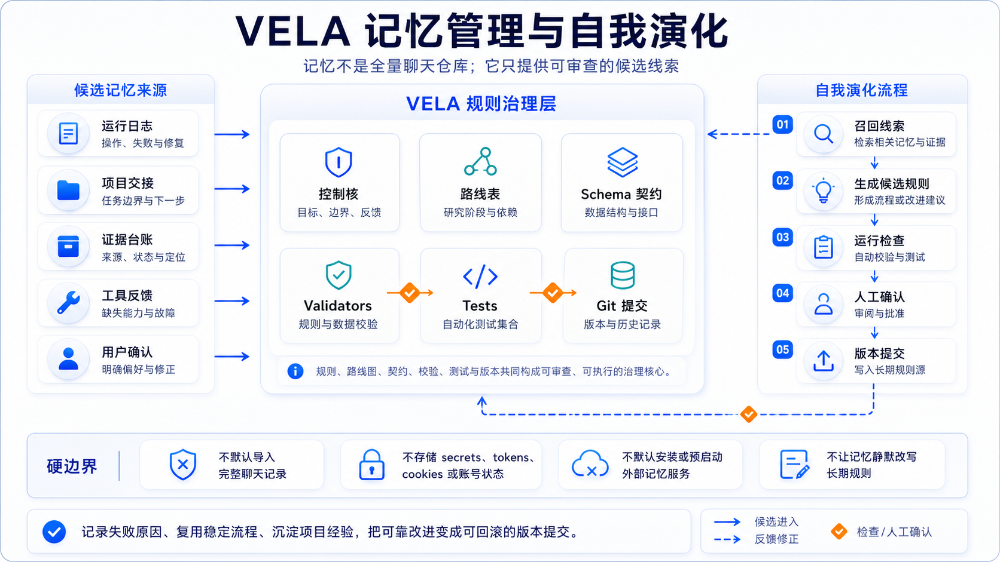
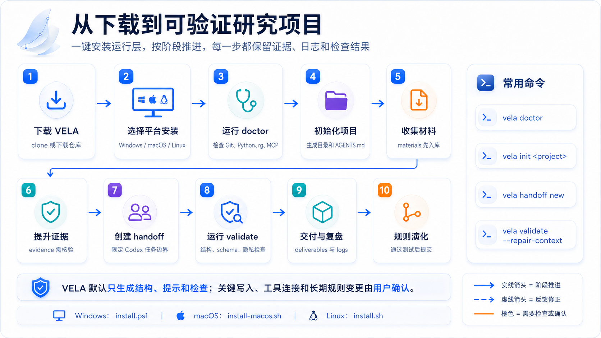

# VELA

**Versioned Evidence Lifecycle Architecture**

VELA is a portable Codex workflow package for evidence-based research projects. It gives each project a readable file structure, schema-checked handoffs, evidence and claim ledgers, validation reports, privacy scans, and a machine-readable project context.

Its operating model is engineering-cybernetic: objectives, state, feedback signals, validation gates, and correction loops are all visible in files.

It can interoperate with HELM through explicit local files, but VELA does not require HELM.

## Visual Guide









## Start

```bash
git clone https://github.com/Marcus-AI4SS/VELA.git vela
cd vela
sh ./install.sh --bootstrap-tools
vela init ../my-research-project --skip-codex-trust
```

Windows users can run `.\install.ps1 -BootstrapTools`. macOS users can run `sh ./install-macos.sh`.

## What VELA Adds

- a project scaffold for materials, evidence, claims, methods, deliverables, handoffs, and logs
- `AGENTS.md` rules for bounded Codex work
- `vela.codex.handoff.v1` handoff packets
- `.vela/context.json` using `vela.project.context.v1`
- validators for project structure, handoffs, privacy, and sharing readiness
- engineering-cybernetic governance for objectives, state, feedback, gates, and correction
- memory and self-evolution governance where durable rules require validation, tests, and versioned commits
- optional runtime skills and `envctl` helpers installed into the user's own Codex environment

## Environment Map

| Part | Description |
| --- | --- |
| Seven-layer structure | task boundary, tools/interfaces, context/evidence, research stage, runtime logs, reliability checks, environment governance |
| Skills | orchestration, literature/evidence, computational social science, writing/export, figures/presentation, runtime helpers, knowledge sync |
| Plugins | Native Browser, Chrome, Computer Use, GitHub, Superpowers, Zotero, Scite, Google Drive, Documents, Presentations, Spreadsheets, and related optional layers |
| MCP | OpenAlex, Semantic Scholar, Google Scholar, paper-search, Chrome DevTools, social-platform, and CodeGraph are route-scoped helpers; native Browser/Chrome/Computer Use comes first |
| Automation | doctor, runtime install, validate, privacy scan, envctl route/stack/memory/evolution checks |
| Memory governance | memory is a candidate signal; durable rules require schemas, validators, tests, and versioned commits |

Read the full [manual](./manual.md) for the public, user-facing environment guide.
